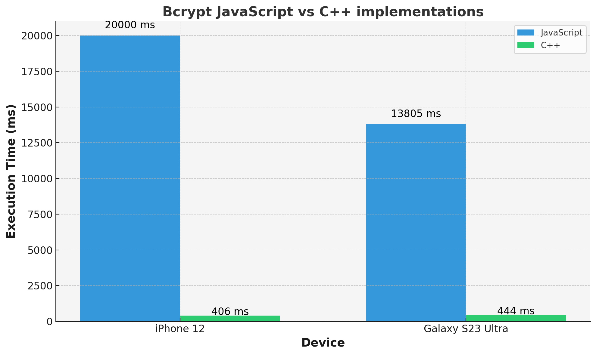

# react-native-bcrypt-cpp

Next-gen React Native library for Bcrypt hashing using pure C++ with Turbo Modules and multithreading for superior performance.

**_NOTE:_** This library can be used only with New Architecture (more information about New Architecture [here](https://github.com/reactwg/react-native-new-architecture))

## Features

- **50x faster than JS implementation** 🚀
- **Multithreaded for high performance without blocking the JS thread** 🧵
- **Seamless integration with Turbo Modules** 🔌
- **Native C++ hashing for maximum security** 🔒
- **Supports both asynchronous and synchronous operations** ⚡️
- **Optimized for React Native's New Architecture** 📱

## Performance

The C++ implementation of Bcrypt hashing is significantly faster than the JavaScript implementation, especially for high-cost factors. Here are some benchmarks comparing the two implementations:



## Demo

After running "Generate Hash" function on JS side, it blocks JS Thread while the function runs (approximately 14 seconds). On the other hand, the C++ implementation runs the same function in a separate thread, allowing the JS thread to continue executing other tasks without blocking (approximately 0.3 seconds). This demonstrates the superior performance of the C++ implementation over the JavaScript implementation.

|              JavaScript Demo              |                  C++ Demo                   |
| :---------------------------------------: | :-----------------------------------------: |
|  |  |
|          **JavaScript Hashing**           |               **C++ Hashing**               |

## Installation

```sh
npm install react-native-bcrypt-cpp
```

or

```sh
yarn add react-native-bcrypt-cpp
```

### Linking

```sh
cd ios && bundle install && RCT_NEW_ARCH_ENABLED=1 bundle exec pod install
```

## Usage

### Asynchronous Hashing (Multithreaded)

```js
import { generateHash, validatePassword } from 'react-native-bcrypt-cpp';

// Generate a hash asynchronously
const hash = await generateHash('password', 12);

// Validate a password against a hash
const isValid = await validatePassword('password', hash);
```

### Synchronous Hashing (Single-threaded)

```js
import {
  generateHashSync,
  validatePasswordSync,
} from 'react-native-bcrypt-cpp';

// Generate a hash synchronously
const hash = generateHashSync('password', 12);

// Validate a password against a hash synchronously
const isValid = validatePasswordSync('password', hash);
```

## API Reference

## API Reference

### `generateHash(password: string, workload: number): Promise<string>`

Asynchronously generates a Bcrypt hash for the given password with the specified workload factor.

**Parameters:**

- `password` (string): The password to hash.
- `workload` (number): The cost factor for the hashing algorithm (e.g., 12).

**Returns:**

- A `Promise` that resolves to a `string` containing the generated hash.

### `validatePassword(password: string, hash: string): Promise<boolean>`

Asynchronously validates the given password against the Bcrypt hash.

**Parameters:**

- `password` (string): The password to validate.
- `hash` (string): The Bcrypt hash to validate against.

**Returns:**

- A `Promise` that resolves to a `boolean` indicating whether the password is valid.

### `generateHashSync(password: string, workload: number): string`

Synchronously generates a Bcrypt hash for the given password with the specified workload factor.

**Parameters:**

- `password` (string): The password to hash.
- `workload` (number): The cost factor for the hashing algorithm (e.g., 12).

**Returns:**

- A `string` containing the generated hash.

### `validatePasswordSync(password: string, hash: string): boolean`

Synchronously validates the given password against the Bcrypt hash.

**Parameters:**

- `password` (string): The password to validate.
- `hash` (string): The Bcrypt hash to validate against.

**Returns:**

- A `boolean` indicating whether the password is valid.

## Bcrypt Algorithm Source

This library implements the Bcrypt hashing algorithm in C++, adapted from the [Bcrypt.cpp project](https://github.com/hilch/Bcrypt.cpp?tab=License-1-ov-file) by Hilko Bengen.
This product includes software developed by Niels Provos.

## Contributing

See the [contributing guide](CONTRIBUTING.md) to learn how to contribute to the repository and the development workflow.

## License

This project is licensed under the MIT License. See the [LICENSE](LICENSE) file for details.

---

Made with [create-react-native-library](https://github.com/callstack/react-native-builder-bob)
